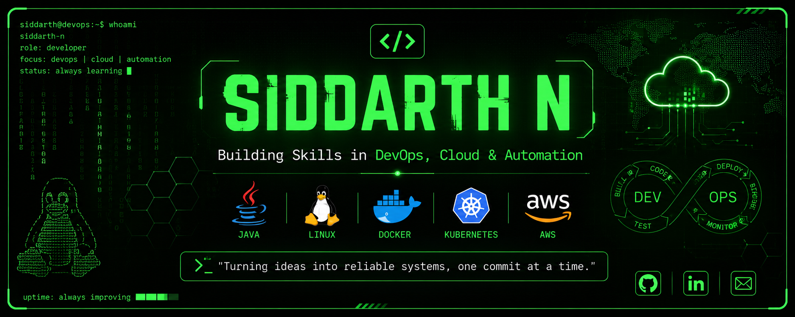

<div align="center">

<p align="center">
  
</p>


# 👨‍💻 Siddarth N

### Computer Science Student | Building Skills in DevOps, Cloud & Automation


</div>

---

# 💻 About Me

```text
$ whoami

👨‍🎓 Computer Science Student

🌱 Building Skills in DevOps, Cloud & Automation

🏆 VISAI 2026 International Project Competition
🥉 3rd Prize

🌳 Creator of TimberByte

📍 India
```

---

# ⚡ Current Focus

- ☕ Java & DSA
- 🐧 Linux
- 🌳 Git & GitHub
- 🐳 Docker
- ☸ Kubernetes
- ☁ AWS
- ⚙ CI/CD
- 📚 Open Source

---

# 🛠 Tech Stack

<p align="center">


</p>

---

# 🔥 GitHub Streak

<p align="center">


</p>

---

# 📈 Contribution Graph

<p align="center">


</p>

---

# 🌳 Featured Projects

## 🌲 TimberByte

IoT based Illegal Tree Cutting Detection System

**ESP32 • MPU6050 • GPS • Firebase**

🥉 VISAI 2026 - 3rd Prize

---

## ☕ Java DSA

Learning Data Structures & Algorithms in Java

---

## 🌱 Smart Plant Watering System

Automatic Irrigation using ESP32

---

## 🚀 2026 Roadmap

```text
██████████████████████████████████

☑ Java

☑ DSA

☑ Git

⬜ Linux

⬜ Docker

⬜ Kubernetes

⬜ AWS

⬜ Jenkins

⬜ Terraform

⬜ CI/CD

⬜ DevOps Projects

██████████████████████████████████
```
## 🐍 Contribution Snake

<p align="center">
  
</p>

---

# 💬 Quote

> **"Turning ideas into reliable systems, one commit at a time."**

---

<div align="center">

### 💚 Thanks for visiting my profile!

</div>
